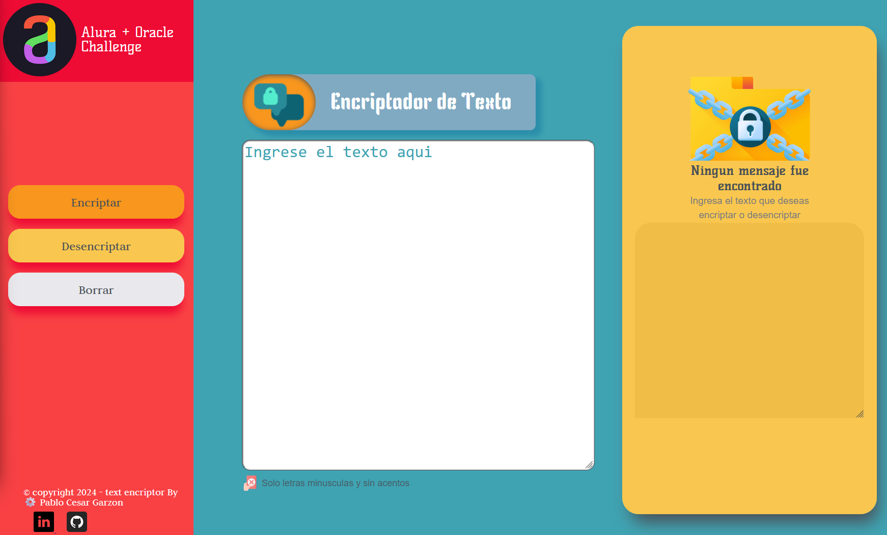

# &#9876; Encriptador de Texto 
   <p align="left">
   
   </p>

 
Este es un encriptador de texto simple creado con HTML, CSS y JavaScript. El proyecto encripta y desencripta texto utilizando las siguientes llaves de encriptación:

- La letra `"e"` se convierte en "enter"
- La letra `"i"` se convierte en "imes"
- La letra `"a"` se convierte en "ai"
- La letra `"o"` se convierte en "ober"
- La letra `"u"` se convierte en "ufat"

## &#128205; Características

- Funciona con letras minúsculas.
- No utiliza letras con acentos ni caracteres especiales.
- Incluye un codificador y decodificador de texto.
- Tiene un botón que copia el texto encriptado/desencriptado al portapapeles (similar a 'ctrl+C').

## &#128230; Uso

1. **Encriptar Texto**:
   - Ingresa el texto que deseas encriptar en el área de texto.
   - Haz clic en el botón "Encriptar".
   - El texto encriptado aparecerá en el área de resultado.

2. **Desencriptar Texto**:
   - Ingresa el texto encriptado en el área de texto.
   - Haz clic en el botón "Desencriptar".
   - El texto desencriptado aparecerá en el área de resultado.

3. **Copiar Texto**:
   - Después de encriptar o desencriptar el texto, puedes copiar el resultado al portapapeles haciendo clic en el botón "Copiar".

## Estructura del Proyecto

El proyecto está organizado de la siguiente manera:

---

- `index.html`: Contiene la estructura HTML del proyecto.
- `styles/styles.css`: Contiene los estilos CSS para la página.
- `scripts/script.js`: Contiene el código JavaScript para la funcionalidad de encriptación y desencriptación.

## Instalación

1. Clona este repositorio en tu máquina local usando `git`:

   ```bash
   git clone https://github.com/PabloGarzonB0/Encriptador_texto_AluraChallenge.git
